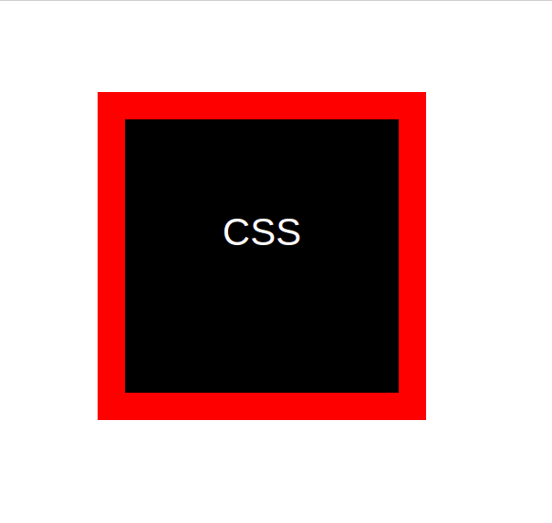
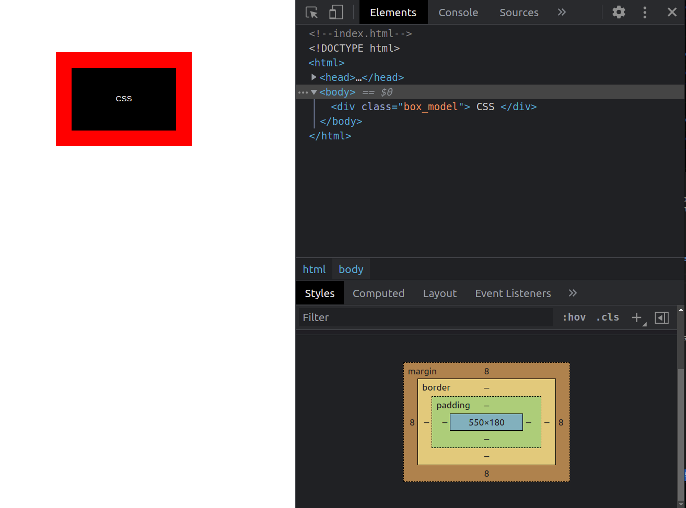

# Tutorials Curated

This repository consists of the tutorials and tasks encountered while learning the fundamentals of web development, and fullstack.

Further it alos consists of some fundamental concepts and important points to be looked into for a satisfactory understandinng of web develoment.

<br />
<br />

## CSS

The basic sytaxes and elements used for styling in css are described below.

<br />

### **CSS basics**

<br />
<br />

### **CSS Box Model**

**Important syntax parameters included for styling box models in css.**

- Padding 
- Border
- Margin
- Box-sizing 
    - Border-box: Makes the height and box account for the padding and border of the element.<br />That is the height and width given are used as the height and with of the box, and the border and padding fit into it.

<br />

**Element (like text,img... in the selector) properties for the box model include:**

- Height 
- Width

<br />
<br />

> An appropriate example on using the sytax for the above elements is as shown:
```css
/*styles.css*/
.box_model {
    color: white;
    background-color: black;
    /* Primary tags to focus on in css box model*/
    padding: 100px;
    border: 30px solid red;
    margin: 100px;
    height: 100px;
    width: 100px;
    /* Additional styles*/
    text-align: center;
    font-family: Verdana, Geneva, Tahoma, sans-serif;
    font-size: 42px;

}
```
**Outcome**



[Refernce:Learn CSS Box Model In 8 Minutes](https://www.youtube.com/watch?v=rIO5326FgPE)

<br />


**Chrome-dev Tools**



